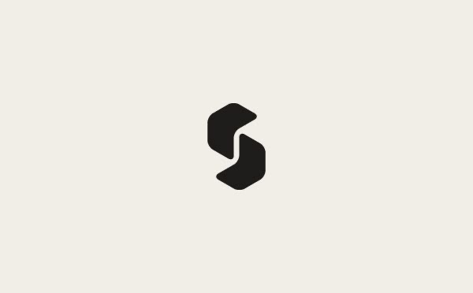

<p align="center">
  
</p>

<h1 align="center">Suite</h1>

<p align="center">
  <strong>Alles an einem Ort.</strong><br>
  Eine KI-Office-Suite, die ausschließlich mit einem lokalen Ollama-Modell arbeitet.
</p>

<p align="center">
  <a href="LICENSE"></a>
  
  
</p>

---

## Worum es geht

Suite ist ein Fork von [GenOffice](https://github.com/genspark-ai/genoffice) mit einer
einzigen, konsequent durchgezogenen Änderung: **es gibt keine Cloud mehr.**

GenOffice spricht mit achtzehn gehosteten KI-Anbietern und setzt ein Genspark-Konto
voraus. Suite spricht mit genau einem Backend — einem Ollama-Daemon auf dem eigenen
Rechner. Kein Konto, kein API-Key, keine Credits. Dokumente und Prompts verlassen das
Gerät nicht.

Dokumente, Tabellen, Präsentationen, PDF, Markdown und HTML — mit einem KI-Agenten, der
echte `.docx`, `.xlsx` und `.pptx` schreibt und bearbeitet.

## Was anders ist als bei GenOffice

| | GenOffice | Suite |
|---|---|---|
| KI-Anbieter | 18 gehostete + Codex CLI | nur lokales Ollama |
| Konto | Genspark-Login nötig | keins |
| Modellliste | fest einkompiliert | live vom Daemon (`/api/tags`) |
| Bildgenerierung | über Cloud-Anbieter | **entfernt** – Ollama hat keinen Endpunkt dafür |
| Bildanalyse | Cloud-Vision-Modelle | lokales Vision-Modell |
| Websuche | Genspark-Konto | schlüsselfrei (DuckDuckGo), Serper/Tavily optional |
| Cloud-Projekte, Credits | vorhanden | entfernt |

Die Modellliste ist bewusst nicht mehr einkompiliert: welche Modelle es gibt, ist eine
Eigenschaft deines Rechners und ändert sich bei jedem `ollama pull`. Die Einstellungen
lesen sie beim Öffnen frisch aus und zeigen pro Modell Parametergröße, Quantisierung und
Fähigkeiten (`vision`, `tools`, `thinking`) an. Ein Modell ohne Tool-Unterstützung wird
markiert — der Agent baut auf Tool-Calls auf und würde sonst nur Prosa liefern.

**Bildgenerierung fehlt ersatzlos.** Ollama liefert keinen Bild-Ausgabe-Endpunkt, und ein
stiller Rückgriff auf einen Cloud-Anbieter würde den Sinn des Forks aufheben. Das
Bild-Skill sagt dem Modell jetzt, es soll ein echtes Bild suchen, statt ein Werkzeug
anzubieten, das nicht funktionieren kann.

## Voraussetzungen

- **[Ollama](https://ollama.com)**, laufend (`ollama serve`)
- Mindestens ein Modell mit Tool-Unterstützung, Vision empfohlen:
  ```bash
  ollama pull qwen3.5      # Tools + Vision + Thinking
  ```
- **Node.js ≥ 22.12** und npm ≥ 10

## Loslegen

```bash
git clone https://github.com/Bennidesign2003/suite-office.git
cd suite-office
npm install
npm run shell            # baut alles und startet die App
```

Beim ersten Start unter **Einstellungen → KI-Modell** ein Modell auswählen. Läuft der
Daemon nicht auf `http://127.0.0.1:11434`, lässt sich der Host dort ändern — auch ein
Ollama auf einem anderen Rechner im Netz funktioniert.

Weitere Skripte:

```bash
npm run dev              # Entwicklungsmodus mit Hot Reload
npm test                 # Unit-Tests aller Pakete
npm run typecheck        # TypeScript über das ganze Monorepo
npm run dist:mac         # Paket bauen (dist:win / dist:linux analog)
```

## Stand

Suite ist in Arbeit. Ehrlich aufgeschlüsselt:

| | |
|---|---|
| KI-Layer vollständig auf Ollama | ✅ fertig |
| Alle sechs Editoren + CLI umgestellt | ✅ fertig |
| Genspark-Konto, Cloud-Projekte, Credits entfernt | ✅ fertig |
| Einstellungen mit Live-Modellauswahl | ✅ fertig |
| Branding (Name, Icons, Oberflächentexte) | 🚧 in Arbeit |
| Webapp statt Electron | 📋 geplant |
| Mail und Kalender | 📋 geplant |

Bekannt: `packages/html2docx/src/convert.ts` hat einen Typfehler, der aus dem
Ursprungsprojekt stammt (nachgeprüft gegen `genspark-ai/genoffice@316ded6`).

## Datenschutz

Standardmäßig verlässt nichts den Rechner. Die einzige Ausnahme ist die **Websuche**,
wenn der Agent sie benutzt — voreingestellt über schlüsselfreie Quellen, optional über
Serper oder Tavily mit eigenem Key. Die Telemetrie des Ursprungsprojekts ist in
Quellbauten ohnehin inaktiv (sie braucht Build-Secrets, die es hier nicht gibt).

## Lizenz und Herkunft

Suite steht unter der [Apache-Lizenz 2.0](LICENSE), genau wie das Ursprungsprojekt.

Dieses Werk ist ein **verändertes Derivat** von
[**GenOffice**](https://github.com/genspark-ai/genoffice) © Genspark AI, veröffentlicht
unter Apache 2.0. Die Originalhinweise stehen unverändert in [`NOTICE`](NOTICE) und
[`LICENSE`](LICENSE).

Wesentliche Änderungen gegenüber dem Original:

- `packages/ai-provider` auf einen einzigen Anbieter (Ollama) reduziert; die
  Anthropic-, Gemini- und Codex-app-server-Transporte wurden entfernt
- Modellerkennung zur Laufzeit über die native Ollama-API ergänzt
- `packages/ai-search`: Genspark-CLI-Backend und Login-Flow entfernt
- Bildgenerierung, Cloud-Projekte, Kontoverwaltung und Credits aus allen Apps entfernt
- Einstellungsoberfläche und Übersetzungen entsprechend überarbeitet
