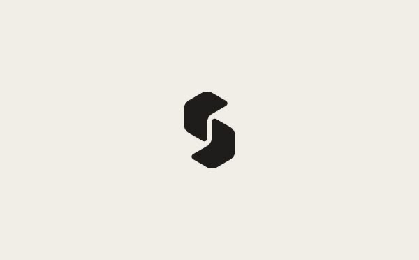

<p align="center">
  
</p>

<h1 align="center">Suite</h1>

<p align="center">
  <strong>Alles an einem Ort.</strong><br>
  Eine KI-Office-Suite, die ausschließlich mit einem lokalen Ollama-Modell arbeitet.
</p>

<p align="center">
  <a href="LICENSE"></a>
  
  
</p>

---

## Worum es geht

Suite ist ein Fork von [GenOffice](https://github.com/genspark-ai/genoffice) mit einer
einzigen, konsequent durchgezogenen Änderung: **es gibt keine Cloud mehr.**

GenOffice spricht mit achtzehn gehosteten KI-Anbietern und setzt ein Genspark-Konto
voraus. Suite spricht mit genau einem Backend — einem Ollama-Daemon auf dem eigenen
Rechner. Kein Konto, kein API-Key, keine Credits. Dokumente und Prompts verlassen das
Gerät nicht.

Dokumente, Tabellen, Präsentationen, PDF, Markdown, HTML und **E-Mail** — mit einem KI-Agenten, der
echte `.docx`, `.xlsx` und `.pptx` schreibt und bearbeitet.

## Was anders ist als bei GenOffice

|                         | GenOffice                | Suite                                              |
| ----------------------- | ------------------------ | -------------------------------------------------- |
| KI-Anbieter             | 18 gehostete + Codex CLI | nur lokales Ollama                                 |
| Konto                   | Genspark-Login nötig     | keins                                              |
| Modellliste             | fest einkompiliert       | live vom Daemon (`/api/tags`)                      |
| Bildgenerierung         | über Cloud-Anbieter      | **entfernt** – Ollama hat keinen Endpunkt dafür    |
| Bildanalyse             | Cloud-Vision-Modelle     | lokales Vision-Modell                              |
| Websuche                | Genspark-Konto           | schlüsselfrei (DuckDuckGo), Serper/Tavily optional |
| Cloud-Projekte, Credits | vorhanden                | entfernt                                           |

Die Modellliste ist bewusst nicht mehr einkompiliert: welche Modelle es gibt, ist eine
Eigenschaft deines Rechners und ändert sich bei jedem `ollama pull`. Die Einstellungen
lesen sie beim Öffnen frisch aus und zeigen pro Modell Parametergröße, Quantisierung und
Fähigkeiten (`vision`, `tools`, `thinking`) an. Ein Modell ohne Tool-Unterstützung wird
markiert — der Agent baut auf Tool-Calls auf und würde sonst nur Prosa liefern.

**Bildgenerierung fehlt ersatzlos.** Ollama liefert keinen Bild-Ausgabe-Endpunkt, und ein
stiller Rückgriff auf einen Cloud-Anbieter würde den Sinn des Forks aufheben. Das
Bild-Skill sagt dem Modell jetzt, es soll ein echtes Bild suchen, statt ein Werkzeug
anzubieten, das nicht funktionieren kann.

## Voraussetzungen

- **[Ollama](https://ollama.com)**, laufend (`ollama serve`)
- Mindestens ein Modell mit Tool-Unterstützung, Vision empfohlen:
  ```bash
  ollama pull qwen3.5      # Tools + Vision + Thinking
  ```
- **Node.js ≥ 22.12** und npm ≥ 10

## Loslegen

```bash
git clone https://github.com/Bennidesign2003/suite-office.git
cd suite-office
npm install
npm run web              # baut bei Bedarf alles und öffnet Suite im Browser
```

Suite läuft dann unter **http://localhost:4317/**. Wer lieber die Desktop-App
(Electron) will: `npm run shell`.

Beim ersten Start unter **Einstellungen → KI-Modell** ein Modell auswählen. Läuft der
Daemon nicht auf `http://127.0.0.1:11434`, lässt sich der Host dort ändern — auch ein
Ollama auf einem anderen Rechner im Netz funktioniert.

Weitere Skripte:

```bash
npm run web:rebuild      # alles neu bauen und im Browser starten
npm run shell            # Desktop-App (Electron) statt Browser
npm run dev              # Entwicklungsmodus mit Hot Reload (Electron)
npm test                 # Unit-Tests aller Pakete
npm run typecheck        # TypeScript über das ganze Monorepo
npm run dist:mac         # Paket bauen (dist:win / dist:linux analog)
```

## Im Browser (`npm run web`)

Der Web-Modus braucht keinen eigenen Code-Zweig der Editoren: ein Node-Server
(`apps/web`) führt den gebauten Hauptprozess der Shell aus und beantwortet
`require('electron')` mit einer Web-Umsetzung. Jede Editor-Seite läuft im Browser,
ihre IPC-Aufrufe gehen über einen WebSocket an den Server.

- **Tabs** sind iframes, die der Server so anordnet wie früher die `WebContentsView`s.
- **Dialoge** (Meldungen, Öffnen/Speichern) und **Menüs** zeichnet die Seite selbst.
  Der Dateidialog zeigt das Dateisystem des Rechners, auf dem der Server läuft,
  und kann zusätzlich Dateien vom eigenen Computer hochladen.
- **Tastenkürzel** des Anwendungsmenüs (Strg/⌘+S, +O, …) funktionieren wie in der App.
- **PDF-Export und Druck** rendern in einem unsichtbaren Chromium auf dem Server.
  Gesucht werden Chrome, Chromium, Edge oder Brave; ein anderer Pfad lässt sich mit
  `SUITE_CHROMIUM=/pfad/zum/browser` angeben.
- Per Drag & Drop in den Browser gezogene Dateien landen in `Dokumente/Suite Uploads`.

Einstellungen über Umgebungsvariablen:

| Variable            | Standard    | Bedeutung                                                         |
| ------------------- | ----------- | ----------------------------------------------------------------- |
| `SUITE_PORT`        | `4317`      | Port der App (Dokumentinhalte laufen auf `SUITE_PORT + 1`)        |
| `SUITE_HOST`        | `127.0.0.1` | Adresse; `0.0.0.0` macht Suite im Netzwerk erreichbar             |
| `SUITE_PUBLIC_HOST` | –           | zusätzlicher Hostname, unter dem der Browser den Server anspricht |
| `SUITE_NO_OPEN`     | –           | beim Start keinen Browser-Tab öffnen                              |
| `SUITE_CHROMIUM`    | automatisch | Chromium für PDF-Export und Druck                                 |

> ⚠️ Der Server hat vollen Zugriff auf deine Dateien. Standardmäßig lauscht er nur
> auf diesem Rechner; mit `SUITE_HOST=0.0.0.0` bitte nur in vertrauenswürdigen Netzen.

Bekannte Grenzen im Browser: Bildschirmaufnahme (Screenshot einfügen) gibt es nicht;
die Zwischenablage des Systems ist nur so weit erreichbar, wie der Browser es erlaubt;
ein Neuladen der Seite lädt offene Editor-Tabs neu (vorher speichern).

## Stand

Suite ist in Arbeit. Ehrlich aufgeschlüsselt:

|                                                  |              |
| ------------------------------------------------ | ------------ |
| KI-Layer vollständig auf Ollama                  | ✅ fertig    |
| Alle sechs Editoren + CLI umgestellt             | ✅ fertig    |
| Genspark-Konto, Cloud-Projekte, Credits entfernt | ✅ fertig    |
| Einstellungen mit Live-Modellauswahl             | ✅ fertig    |
| Branding (Name, Icons, Oberflächentexte)         | 🚧 in Arbeit |
| Webapp: läuft im Browser (`npm run web`)         | ✅ fertig    |
| Mail (IMAP/SMTP) mit Suite AI                    | ✅ fertig    |
| Kalender                                         | 📋 geplant   |

Der aus dem Ursprungsprojekt stammende Typfehler in
`packages/html2docx/src/convert.ts` ist behoben; `npm run typecheck` läuft sauber durch.

## Mail

Die Karte **E-Mail** auf der Startseite öffnet das Postfach (ein Tab, wie Outlook):
Ordner, Lesen, Antworten, Allen antworten, Weiterleiten, Anhänge, Verschieben,
Löschen, Suche. Konten werden per IMAP/SMTP verbunden; für Gmail, Outlook.com, iCloud,
GMX, WEB.DE, T-Online, Yahoo, Posteo und mailbox.org sind die Server hinterlegt — dort
genügen Adresse und (App-)Passwort.

**Suite AI** im Mail-Tab arbeitet wie in Docs mit deinem lokalen Ollama-Modell:
E-Mails zusammenfassen, Aufgaben und Termine herausziehen, übersetzen, Fragen zur Mail
beantworten, Antworten entwerfen und eigene Entwürfe umformulieren (professioneller,
kürzer, freundlicher, Rechtschreibung, Übersetzung, aus Stichpunkten).

Externe Bilder in HTML-Mails sind blockiert, bis du sie freigibst; Mails werden in einem
Rahmen ohne Skripte angezeigt. Zugangsdaten liegen nur auf deinem Rechner
(`mail-accounts.json` im Benutzerordner, verschlüsselt über den Schlüsselbund des
Betriebssystems, wo verfügbar).

## Datenschutz

Standardmäßig verlässt nichts den Rechner. Ausnahmen sind die **Websuche**, wenn der
Agent sie benutzt — voreingestellt über schlüsselfreie Quellen, optional über Serper oder
Tavily mit eigenem Key —, und natürlich **E-Mail**: Mails gehen direkt zwischen deinem
Rechner und deinem Mail-Anbieter hin und her. Die KI liest sie nur lokal über Ollama. Die Telemetrie des Ursprungsprojekts ist in
Quellbauten ohnehin inaktiv (sie braucht Build-Secrets, die es hier nicht gibt).

## Lizenz und Herkunft

Suite steht unter der [Apache-Lizenz 2.0](LICENSE), genau wie das Ursprungsprojekt.

Dieses Werk ist ein **verändertes Derivat** von
[**GenOffice**](https://github.com/genspark-ai/genoffice) © Genspark AI, veröffentlicht
unter Apache 2.0. Die Originalhinweise stehen unverändert in [`NOTICE`](NOTICE) und
[`LICENSE`](LICENSE).

Wesentliche Änderungen gegenüber dem Original:

- `packages/ai-provider` auf einen einzigen Anbieter (Ollama) reduziert; die
  Anthropic-, Gemini- und Codex-app-server-Transporte wurden entfernt
- Modellerkennung zur Laufzeit über die native Ollama-API ergänzt
- `packages/ai-search`: Genspark-CLI-Backend und Login-Flow entfernt
- Bildgenerierung, Cloud-Projekte, Kontoverwaltung und Credits aus allen Apps entfernt
- Einstellungsoberfläche und Übersetzungen entsprechend überarbeitet
- Oberfläche in „Suite Office“ umbenannt, eigenes Logo; Verweise auf das
  Ursprungs-Repository durch dieses ersetzt
- Neuer Web-Modus (`apps/web`): Suite läuft im Browser
- Neues Mail-Modul (`apps/mail`) mit IMAP/SMTP und lokaler KI
- Proxy-Einstellungen leiten Anfragen an das lokale Ollama nicht mehr über den Proxy
